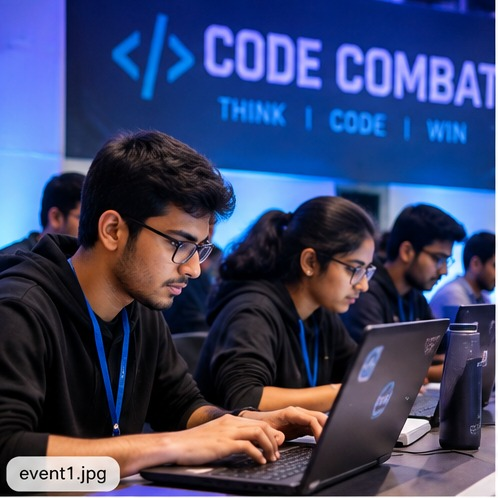
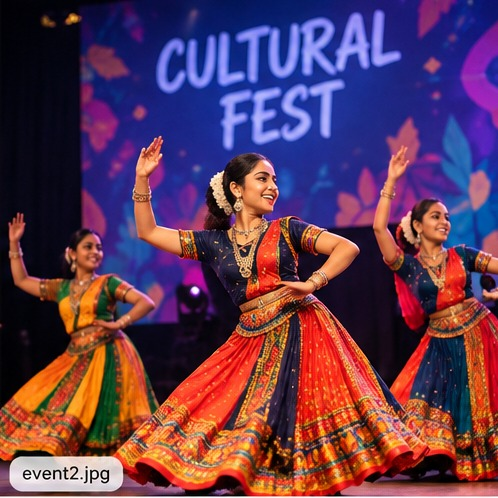
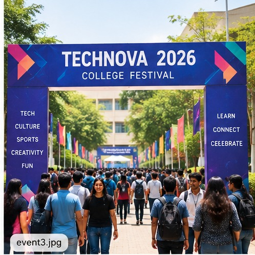
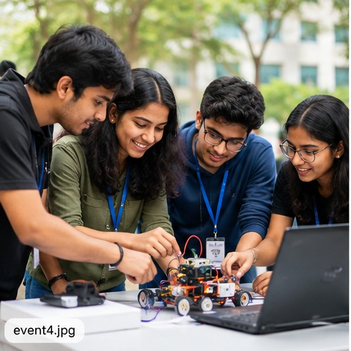
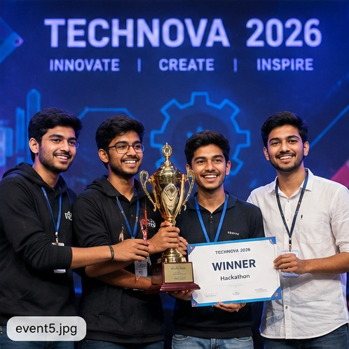
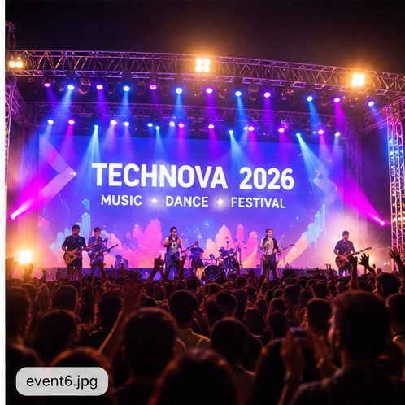

# 🎓 TECHNOVA 2026 — College Event Portal

A responsive and interactive **College Event Portal** developed for **TECHNOVA 2026**, designed to provide students with a centralized platform to explore college events, announcements, schedules, event galleries, and registration information.

## 📌 Project Overview

The **TECHNOVA 2026 College Event Portal** is a front-end web application developed using **HTML5, CSS3, Bootstrap 5, and JavaScript**.

The portal provides an organized and attractive interface where students can explore event information, view announcements, check schedules, browse event images, and interact with registration/contact forms.

## 🎯 Objectives

- Create a centralized portal for TECHNOVA 2026.
- Display college event information in an organized format.
- Provide event announcements and schedules.
- Display a gallery containing event images.
- Provide registration and contact forms.
- Implement JavaScript-based form validation.
- Provide interactive event filtering.
- Display dynamic messages based on user interactions.
- Create a responsive website suitable for desktop, tablet, and mobile devices.

## ✨ Key Features

- 🏠 **Home Section** — Introduction to TECHNOVA 2026.
- 📢 **Announcements** — Displays important event updates.
- 🎯 **Event Section** — Displays TECHNOVA event information.
- 📅 **Event Schedule** — Provides event timing and schedule details.
- 🖼️ **Event Gallery** — Displays six event/festival images.
- 📝 **Registration Form** — Allows participants to submit their details.
- 📩 **Contact Form** — Provides an interface for enquiries.
- 🔎 **Event Filtering** — Helps users find relevant events.
- ✅ **Form Validation** — Validates user input using JavaScript.
- 💬 **Dynamic Messages** — Displays user-friendly success and error messages.
- 📱 **Responsive Design** — Works across different screen sizes.

## 🛠️ Technologies Used

| Technology | Purpose |
|---|---|
| HTML5 | Structure and semantic content |
| CSS3 | Custom styling and responsive design |
| Bootstrap 5 | Responsive layout and UI components |
| JavaScript | Interactivity, filtering, validation, and dynamic messages |

## 📂 Project Structure

    College-Event-Portal/
    │
    ├── index.html
    ├── style.css
    ├── script.js
    │
    └── images/
        ├── event1.jpg
        ├── event2.jpg
        ├── event3.jpg
        ├── event4.jpg
        ├── event5.jpg
        └── event6.jpg

## 🖼️ Event Gallery

The project includes six event/festival images:

- `images/event1.jpg`
- `images/event2.jpg`
- `images/event3.jpg`
- `images/event4.jpg`
- `images/event5.jpg`
- `images/event6.jpg`

### Gallery Preview

## ⚙️ How to Run the Project

### Method 1 — Open Directly

1. Download or clone the repository.
2. Open the `College-Event-Portal` folder.
3. Double-click `index.html`.
4. The TECHNOVA 2026 College Event Portal will open in the browser.

### Method 2 — Using Visual Studio Code

1. Open the project folder in Visual Studio Code.
2. Open `index.html`.
3. Install the **Live Server** extension if required.
4. Right-click `index.html`.
5. Select **Open with Live Server**.
6. The project will open in the browser.

## 🧪 Testing

The following functionalities were tested:

- Navigation between portal sections.
- Event information display.
- Event filtering.
- Registration form.
- Contact form.
- Form validation.
- Dynamic success/error messages.
- Event gallery image loading.
- Responsive layout.
- Browser compatibility.

## 🎓 Learning Outcomes

This project helped in understanding:

- HTML5 page structure.
- Semantic HTML elements.
- CSS3 styling.
- Responsive web design.
- Bootstrap 5 grid and components.
- JavaScript DOM manipulation.
- JavaScript event handling.
- Client-side form validation.
- Dynamic content handling.
- Interactive event filtering.
- Web project file organization.

## 🔮 Future Enhancements

The project can be further enhanced by adding:

- Backend server integration.
- Database-based event registration.
- Student login and authentication.
- Admin dashboard.
- Event seat availability.
- Online registration management.
- Email confirmation for participants.
- QR-code based event passes.
- Event feedback system.
- Cloud deployment.

## 📚 Project Type

**Academic Mini Project / Front-End Web Development Project**

## 👩‍💻 Developed By

**Reshmitha Kukati**

**Department:** Artificial Intelligence & Data Science

**Institution:** Prathyusha Engineering College

## 🏷️ GitHub Topics

`html5` `css3` `bootstrap5` `javascript` `college-event-portal` `event-management` `college-events` `technova-2026` `frontend-project` `web-development` `responsive-web-design`

## 📄 License

This project is developed for academic and educational purposes.

---

⭐ **TECHNOVA 2026 — Connecting Students, Events & Experiences**
